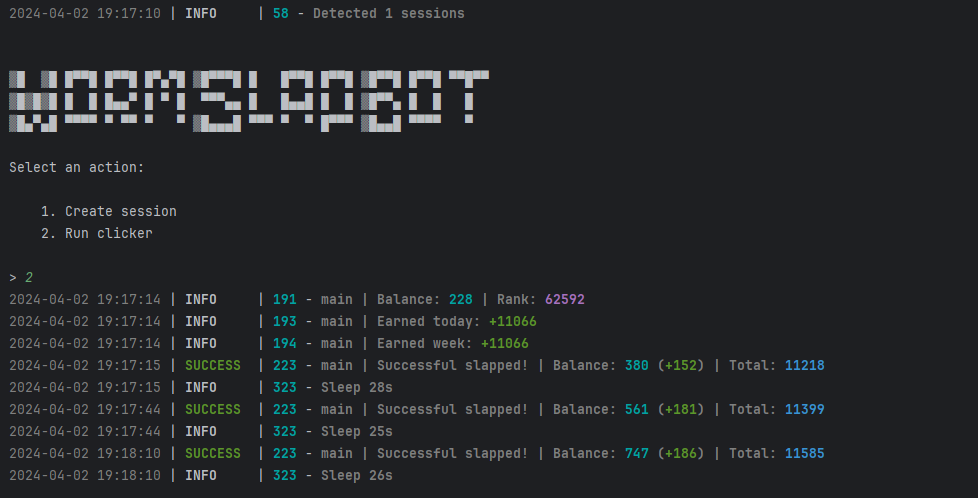

[](https://t.me/sho6ot)




> 🇷🇺 README на русском доступен [здесь](README.md)

## Functionality
| Functional                                                     | Supported |
|----------------------------------------------------------------|:---------:|
| Multithreading                                                 |     ✅     |
| Binding a proxy to a session                                   |     ✅     |
| Auto-purchase of items if you have coins (tap, energy, charge) |     ✅     |
| Random sleep time between clicks                               |     ✅     |
| Random number of clicks per request                            |     ✅     |
| Support tdata / pyrogram .session / telethon .session          |     ✅     |

## [Settings](https://github.com/shamhi/WormSlapBot/blob/main/.env-example)
| Настройка                | Описание                                                                               |
|--------------------------|----------------------------------------------------------------------------------------|
| **API_ID / API_HASH**    | Platform data from which to launch a Telegram session (stock - Android)                |
| **MIN_AVAILABLE_ENERGY** | Minimum amount of available energy, upon reaching which there will be a delay (eg 100) |
| **SLEEP_BY_MIN_ENERGY**  | Delay when reaching minimum energy in seconds (eg 200)                                 |
| **ADD_SLAPS_ON_TURBO**   | How many taps will be added when turbo is activated (eg 2500)                          |
| **AUTO_UPGRADE_SLAP**    | Should I improve the tap (True / False)                                                |
| **MAX_SLAP_LEVEL**       | Maximum level of tap pumping (up to 20)                                                |
| **AUTO_UPGRADE_ENERGY**  | Should I improve the energy (True / False)                                             |
| **MAX_ENERGY_LEVEL**     | Maximum level of energy pumping (up to 20)                                             |
| **AUTO_UPGRADE_CHARGE**  | Should I improve the charge (True / False)                                             |
| **MAX_CHARGE_LEVEL**     | Maximum level of charge pumping (up to 5)                                              |
| **APPLY_DAILY_ENERGY**   | Whether to use the daily free energy boost (True / False)                              |
| **APPLY_DAILY_TURBO**    | Whether to use the daily free turbo boost (True / False)                               |
| **RANDOM_CLICKS_COUNT**  | Random number of taps (eg 50,200)                                                      |
| **SLEEP_BETWEEN_SLAP**   | Random delay between taps in seconds (eg 10,25)                                        |
| **USE_PROXY_FROM_FILE**  | Whether to use proxy from the `bot/config/proxies.txt` file (True / False)             |

## Installation
You can download [**Repository**](https://github.com/shamhi/WormSlapBot) by cloning it to your system and installing the necessary dependencies:
```shell
~ >>> git clone https://github.com/shamhi/WormSlapBot.git
~ >>> cd WormSlapBot

# If you are using Telethon sessions, then clone the "converter" branch
~ >>> git clone https://github.com/shamhi/WormSlapBot.git -b converter
~ >>> cd WormSlapBot

#Linux
~/WormSlapBot >>> python3 -m venv venv
~/WormSlapBot >>> source venv/bin/activate
~/WormSlapBot >>> pip3 install -r requirements.txt
~/WormSlapBot >>> cp .env-example .env
~/WormSlapBot >>> nano .env # Here you must specify your API_ID and API_HASH , the rest is taken by default
~/WormSlapBot >>> python3 main.py

#Windows
~/WormSlapBot >>> python -m venv venv
~/WormSlapBot >>> venv\Scripts\activate
~/WormSlapBot >>> pip install -r requirements.txt
~/WormSlapBot >>> copy .env-example .env
~/WormSlapBot >>> # Specify your API_ID and API_HASH, the rest is taken by default
~/WormSlapBot >>> python main.py
```

Also for quick launch you can use arguments, for example:
```shell
~/WormSlapBot >>> python3 main.py --action (1/2)
# Or
~/WormSlapBot >>> python3 main.py -a (1/2)

#1 - Create session
#2 - Run clicker
```
